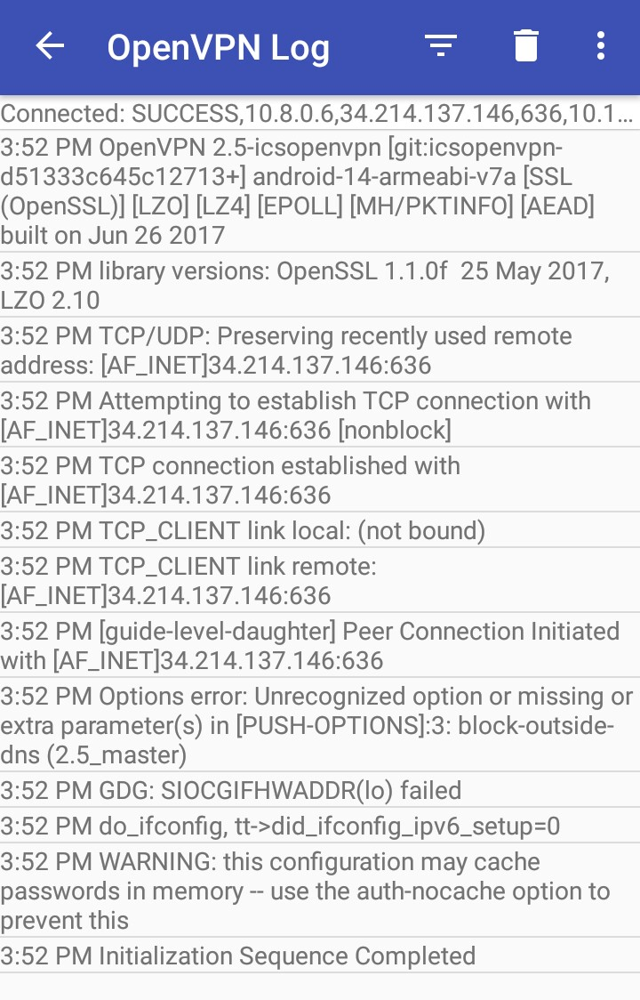

# Sahil Yadav, B15130

# VPN setup

****
See the follow [link](https://htmlpreview.github.io/?https://github.com/me-ydv-5/htmlview/blob/master/batterylow.html)
which completely explains how to set up `streisand` for various platforms. It is a self generated doc.

If you follow the instructions completely, most likely you will be able to connect your client to the VPN. Here's a screenshot of successful connection if you try to connect using `OPEN VPN` app in android.

****

[End of Report]

&copy; Sahil Yadav