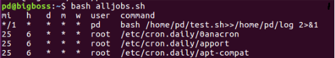

# Task 1
### Step 1
- Rclone 
It is an utility to sync files on multiple cloud storage. 
Installation - https://rclone.org/install/ 
`$ sudo curl https://rclone.org/install.sh | sudo bash` 
Run `rclone config` and add multiple cloud storage accounts.

### Step 2
- Cron 
It is a daemon to execute scheduled commands in linux. 
Aim of using cron is to schedule task of running a bash script every 3 hours which sync files to multiple cloud storages. 
http://www.unixgeeks.org/security/newbie/unix/cron-1.html 
http://man7.org/linux/man-pages/man8/cron.8.html 

Run [this script](alljobs.sh) in your terminal. If you see output like below, then you are good to go to next step, else follow the above given links.

>`sudo nano cog`  
`SHELL=/bin/bash` 
`* */3 * * * cmd`

Replace `cmd` with `cd $file_path && rclone sync $file_name gdrive : $file_name` __i.e.__ terminal command to sync the file every 3 hours. 
You can confirm the scheduled job by running [this script](alljobs.sh) in your terminal. It lists all scheduled jobs by all users by cron daemon.

