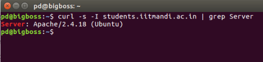
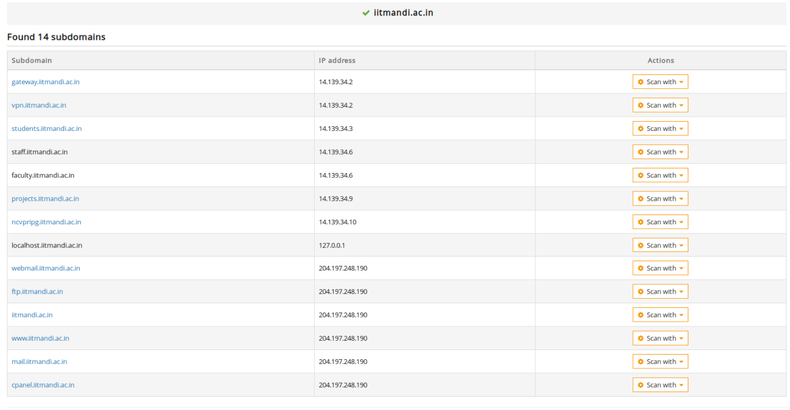
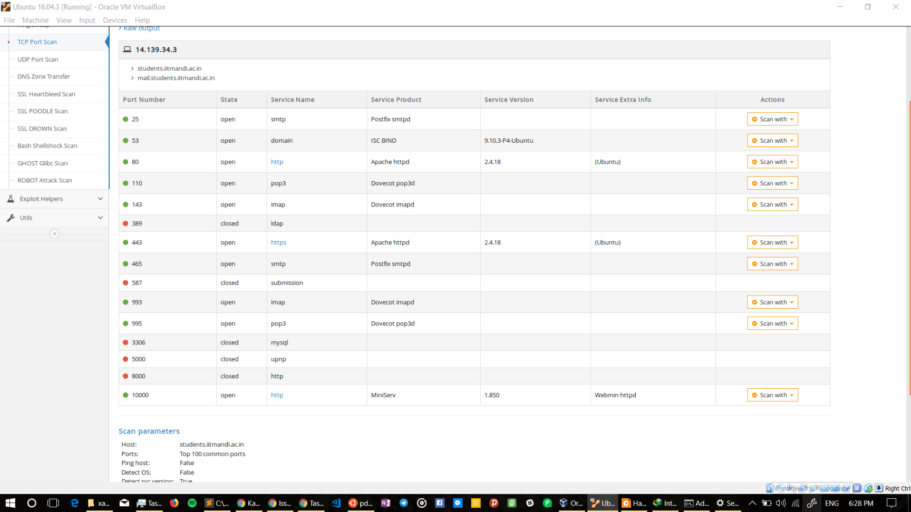
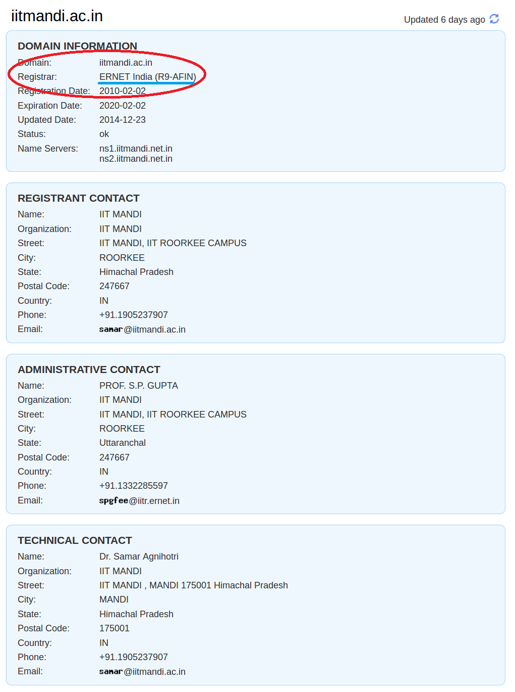

# Task 1
- I was trying to use telnet but again **proxy sucks** (even after setting proxy on terminal and apt). So, I install `proxychains` & edited `/etc/proxychains.conf` then ran `$ sudo proxychains telnet 14.139.34.3 443` and thank god it worked!
- `netstat -plunt` 
Local address column in the output gives information about all open ports of the current network that you are connected to. 

- OS Information of students.iitmandi.ac.in 
    

## Nmap
- `nmap -PN students.iitmandi.ac.in`
[Result](nmap-PN.txt)
- `nmap -A -T4 students.iitmandi.ac.in`
[Result](nmap-A-T4.txt)
## Some web results
Many subdomains are being hosted by domain iitmandi.ac.in. Each subdomain has different set of ports open or closed. For ex- port 22(used for SSH) is open on students.iitmandi.ac.in but is closed on iitmandi.ac.in.
- List of subdomains of iitmandi.ac.in

- List of open TCP Ports on students.iitmandi.ac.in

# Task 2

- `students.iitmandi.ac.in` is a subdomain of `iitmandi.ac.in`.
- `iitmandi.ac.in` domain is bought from **`ERNET India(R9-AFIN)`**

# Task 3

Instead of having data-centers, Duckduckgo uses **AWS Services** to host their servers.