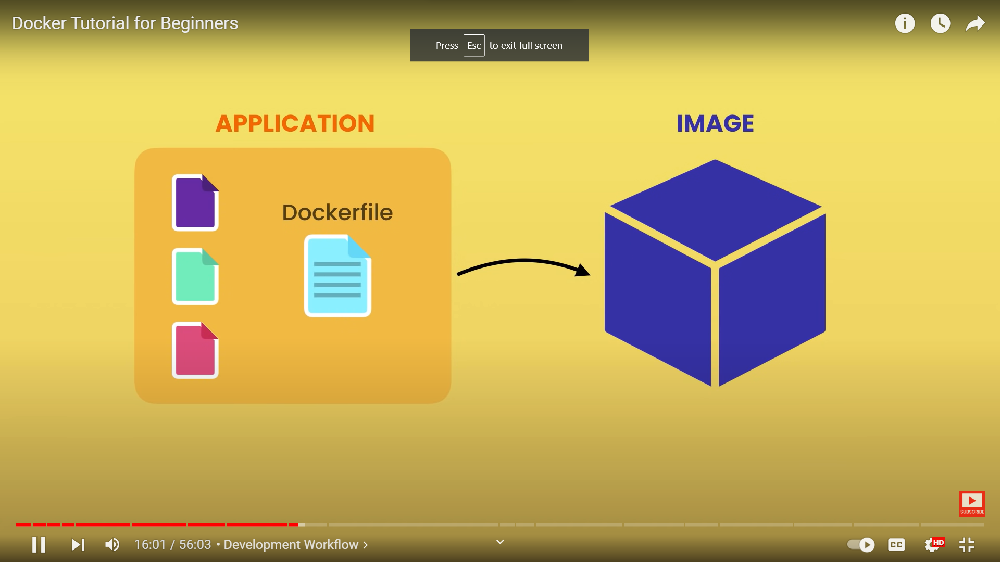
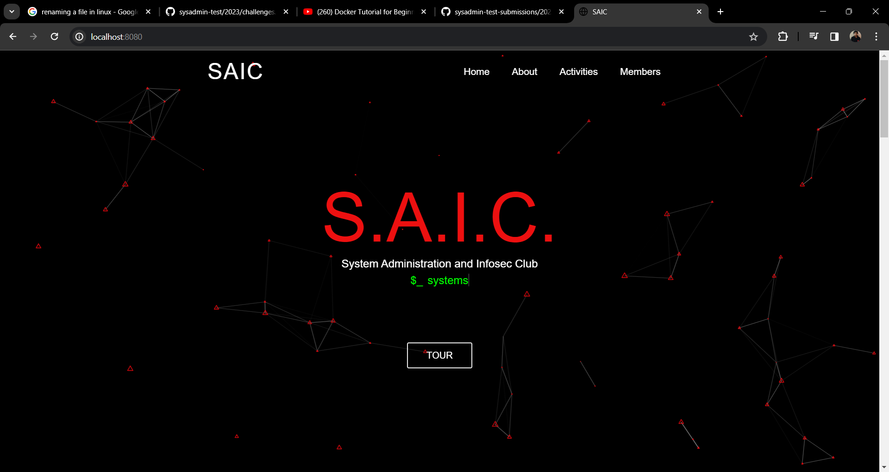
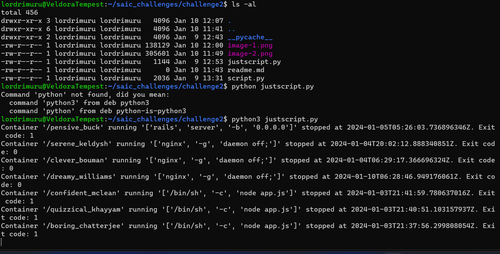
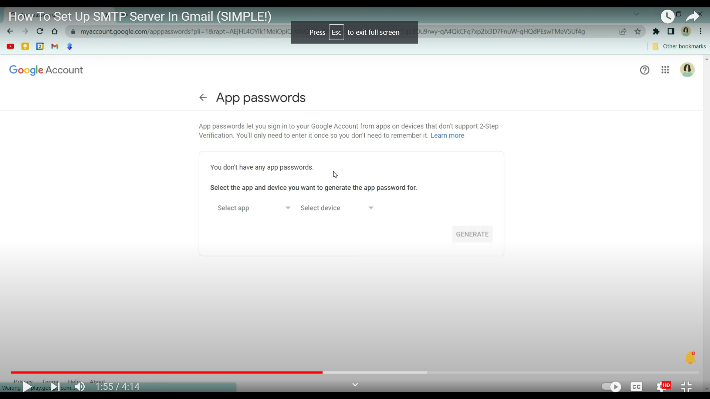
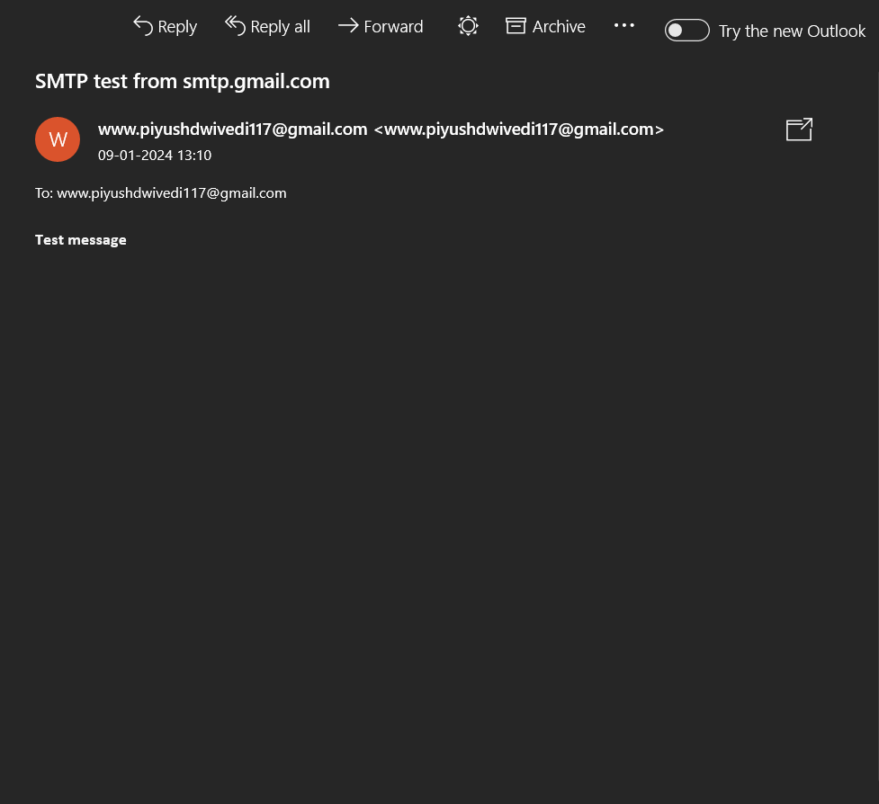
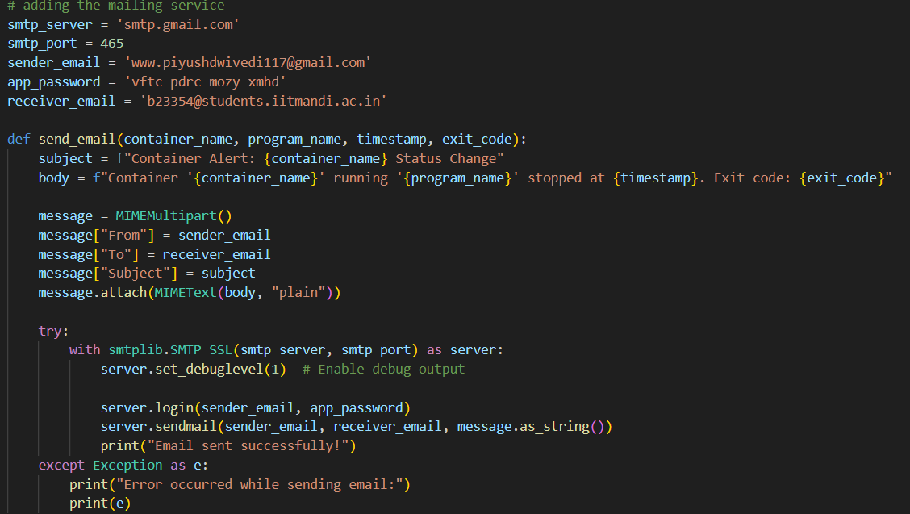
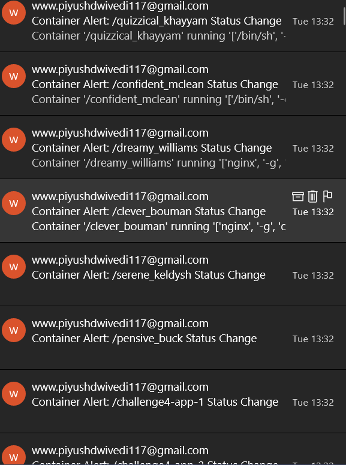

DOCKER BEGINNINGS:
Being new to programming or anything tech-related, I didnt have a clue what docker was.
So to begin my jouurney with docker I turned to my most trusted youtuber Programming with mosh and began to watch his videos of docker and its applications. Here is the link: 'https://youtu.be/pTFZFxd4hOI?si=K79FhlzO0efm8J5P'
'.
I got the basic jist of docker and proceeded to see the previous year solution to similar problems.Therefore I would like to thank Laxman sir('https://github.com/saic-iitmandi/sysadmin-test-submissions/tree/main/2022/LaxTheMan')
Seeing the basic implementations of docker I then proceeded to solve the 3rd question first to see if I was able to deploy a docker conatiner or not.(5 Rupye ki pepsi Laxman sir sexy)  
 BOOM!! I was able to host the saic website(since the code is relevant to q3 I will skip it from including here).Here's a pic of then output

Since our challenge was :
Your challenge is to monitor all the Docker containers running on a host system, and identify if a container exits or changes state from normal/running/active. Additionally, your program should then automatically alert us by sending an email to saic@students.iitmandi.ac.in with helpful info such as Which container? / what program was running inside it? When? Optionally even How did it stop - any error code or traceback? etc.
I first ran some docker containers on my device and then proceeded to write a script which monitors all the details of the containers running on my pc. This contained an hour of me just fu\*\*ing up and then proceeded to write the correct code for monitoring.Here's the code :
[Title](justscript.py)
Here is the output:

Now I had succeeded in getting the alerts on the terminal, I was happy:). I then proceeded to take on the second part of the question: the emailing and as you can probably guess I hadn't done that either. This is where I thought to give up on the question. This included me downloading and removing multiple libraries from my pc.Some of them are: 1. The Mail command 2. WordPress and many more
{put the errors here}
ALL HAIL SMTP MAILING SERVICE:
Then I came to know about gmail's smtp mailing service from hours of research. It talked about something called App passwords and how to use them. I wasn't able to find this in my google account and then finally got a godly youtube video on this topic.
here is the link to youtube video:'https://youtu.be/yuOK6D7deTo?si=gKAxMC7oea60aH09'

I was able to test this mailing service and get positive results.

Next I modified the alerting script which i talked about previously to include mailing service and then proceeded to test it. I was able to get the mail on my gmail account.
Here is the code snippet for adding the mailing service:

Here is the output:

I chose to use seperate mail for each container as it would be easier to identify which container is having issues and it would be easier to debug. I also added the container name in the subject of the mail so that it would be easier to identify the container.It also could be modifies to mail only when that specific cotainer is asked about according the user requirements.  
 CONCLUSION:
I was able to successfully complete the question and am very happy about it. I also learned a lot about docker and its applications. I also learned about mailing services and how to use them and this was majooor plus point for me. I also learned about the importance of googling and how to google properly.
Here is the link to the final code for the question:[Title](final_code.py)
