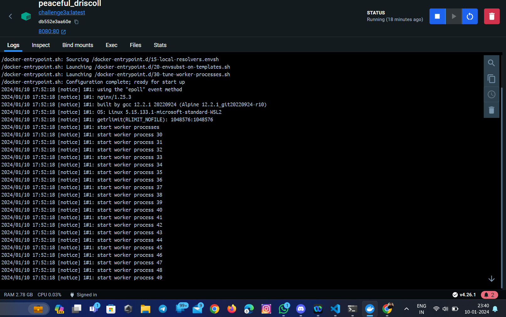
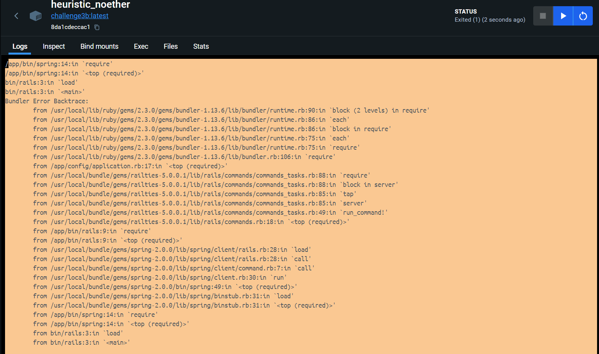
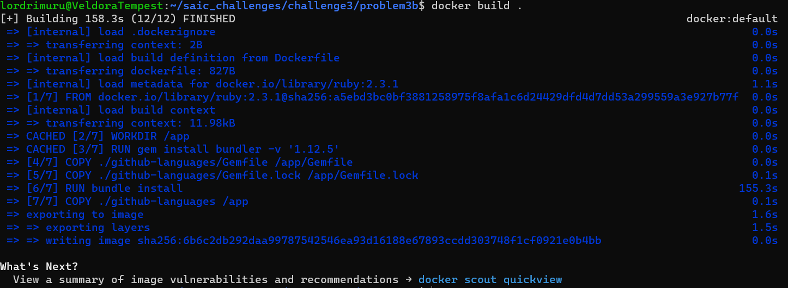
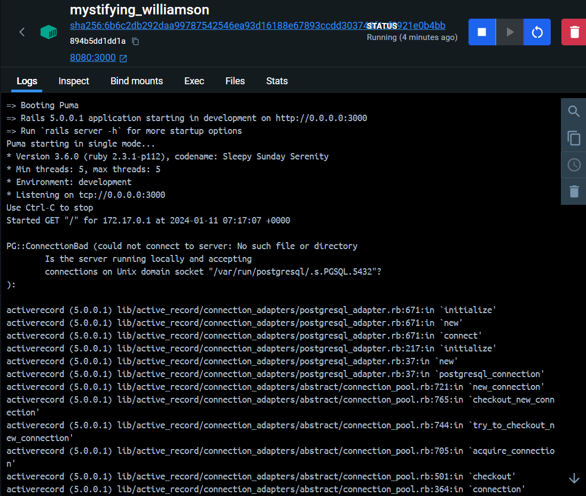
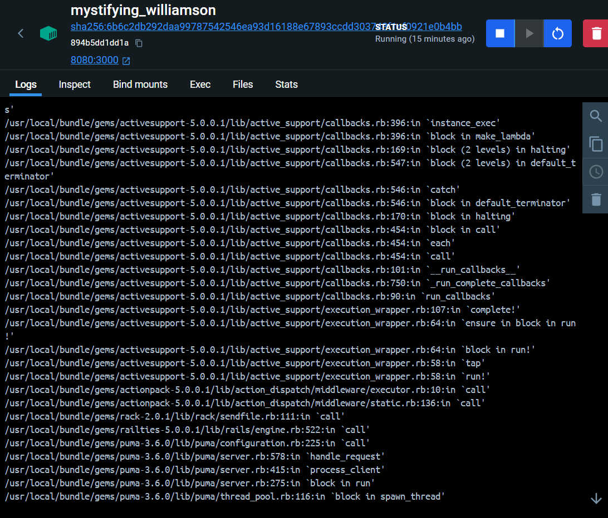
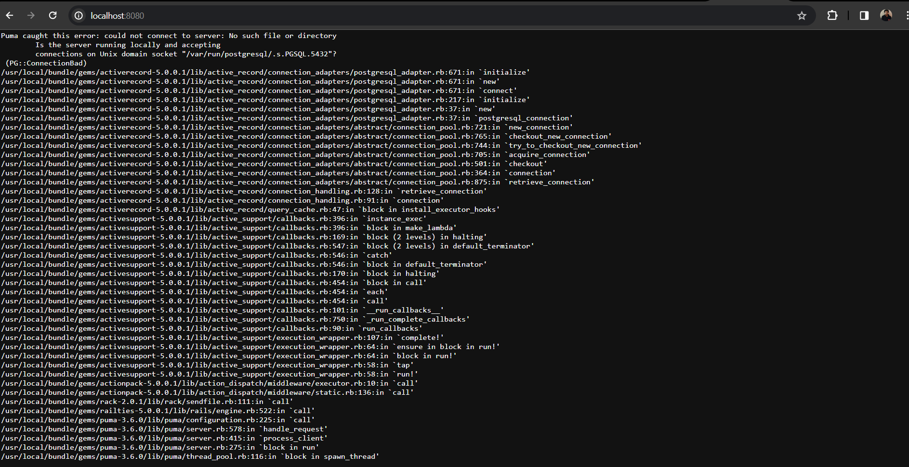

This question required us to solve three inlayed questions: 1. Host both the sites using suitable docker scripts. 2. Create a backup sciprt that backups a volume mapped data as a zip file to a folder of your choice everyday at 11:55 pm.
3 Suggest network types to use for each contaainers

1. HOSTING BOTH THE SITES:
   This was pretty straight forward for the first part which I completed after watching about docker from youtube. I successfully hosted the S.A.I.C website in the port 8080 using the following script:
   script: [Title](problem3a/Dockerfile)
   This was the result:
   
   
   ######## Hosting the second part was a bit tricky and took a lot of time and I mean a lot. Running it simply was not a choice from the start as it gave out the following error:
   
   upon analysing the error using google aand other online sources I found out that one of the gems in the file was not able to run due to a missing JavaScript runtime. I tried to install nodejs and other stuff but it did not work because the ruby version used in the website deatils was very old(almost 7 years back,ruby 2.3.1) and same was the problem with the bundler(old!,version 1.12.5){these were also found after hours of banging my head on the wall for hosting the script}. Therefore after hours of calliberating the correct version, it was very heartbreaking to see the javascript runtime error.

   The gem causing the issue was called the 'uglifier gem' which on further research I found out that it was used to minify the javascript code. So after hours of searchiing the web for literal bits of this gem and js runtime I found the the og "therubyracer" gem. It was based off of mini racer(which i had previously checked to run the gem file but an error was thrown to my face) but it was an ugraded based version. I then proceeded to add the {gem therubyracer} to the existing gemfile of the github-lannguages. I then built the image and it ran beautifully:
   
   
   I then ran script give below to host the website in the port 8080:
   The following is the script:
   script: [Title](problem3b/Dockerfile)##################
   
   
   After running the script I saw the site being hosted on the port 8080 but it gave me the error:
   
   I then proceeded to google the error and found out that the error was due to the fact that the database was not migrated. I had less time and therefore proceeded to skip importing the database and just left the site as it is.
   I had hosted both the sites successfully and was very happy with the result.
   I then proceeded to write the docker compose file to host the site1 at port 8080 and site2 at port 3000 and specified the network in the same. I wrote the following script:
   script: [Title](docker-compose.yml)

2. BACKUP SCRIPT:
   This was a relatively easy task compared to running that god awfull gem site. I did some googling and found that I had to use crontab for the question and wrote a script for regular data backup. I created the following script which best fit both the requirements:
   script: [Title](backup_script.sh)
   Now to run the script at 11:55 pm everyday I used crontab which was a bit tricky as I had to find the correct syntax for the time. I used the following command to run the script at 11:55 pm everyday:
   
   
   This script ran beautifully and created a backup of the data in the folder of my choice.

3. NETWORK TYPES:
   I will come clean and say that I googled what network type to use for each container and got the results and after some more googling I found the reason and what types of network exist.
   The network types I would suggest for the containers are: 1. Bridge Network: This is the default network type for docker and is used to connect the container to the local network. This is the most suitable network type for the container hosting the S.A.I.C website as it is a public website and needs to be connected to the local network. 2. Host Network: This network type is used to connect the container to the host network. This is the most suitable network type for the container hosting the gem website as it is a private website and does not need to be connected to the local network.It is also the fastest network type but may not be the most secure.
   Recommended Network Type: Bridge Network,Host Network
