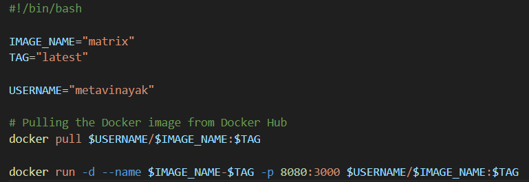
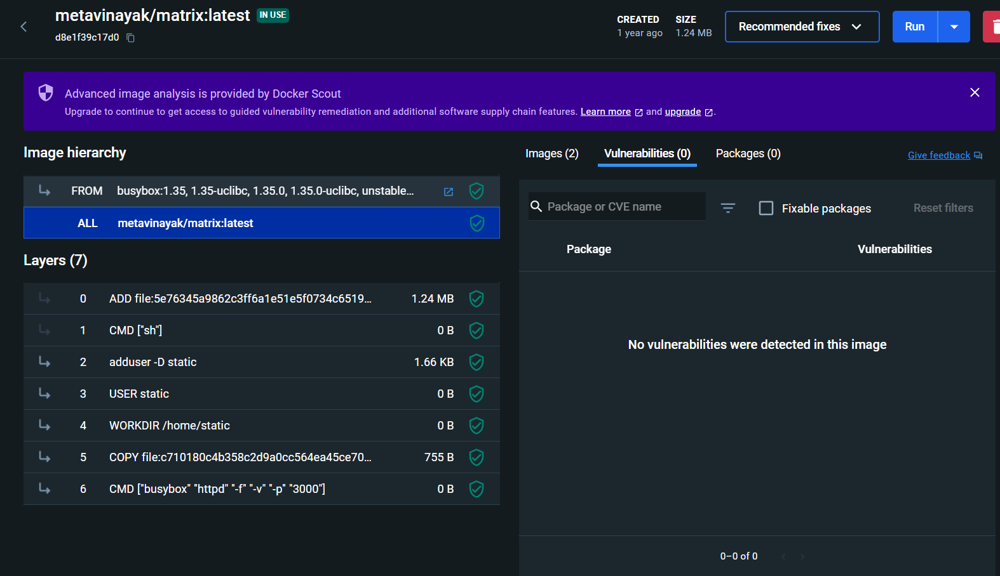
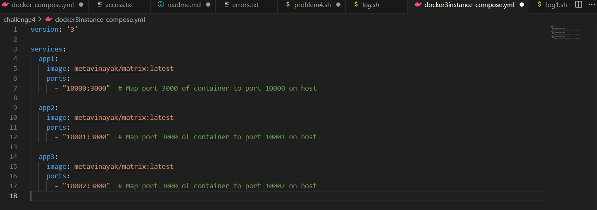
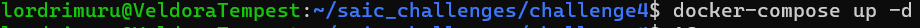
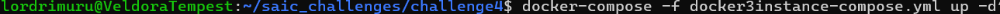
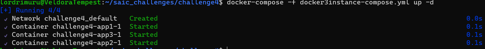
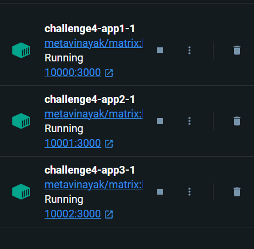
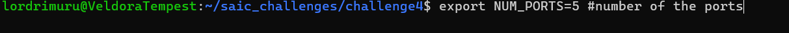
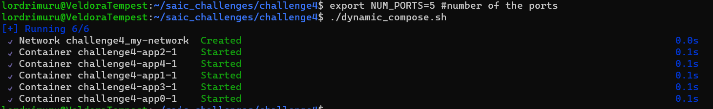
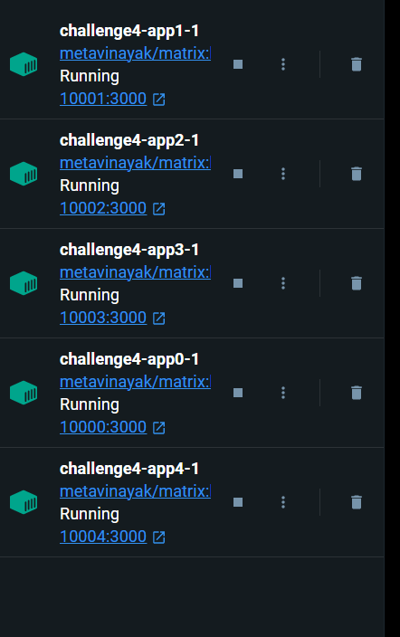

This question had three parts:
    1. pull image from docker hub
    2. run multiple instances of the image and monitor them all
    3. designing a custom log file architecture/format for all running docker instances which you feel is best suited for a single server

1. PULLING THE IMAGE:
    after having done q2 and q3 this part of the challenge was fairly easy to do . I just had to pull the image from docker hub and run it. I used the following command to do so:
                         
        The same could be find in this code : [Title](problem4.sh)
        The image was pulled and run successfully. The output of the same can be found in the following image:
                         
                         

2. RUNNING MULTIPLE INSTANCES OF THE IMAGE AND MONITORING THEM ALL:
    after pulling the image i ran it once and damnnnnnnnn it was gooooodd.The following was the output:
                                <video src="localhost_10001%20-%20Google%20Chrome%202024-01-10%2013-51-39.mp4" controls title="Title"></video>
    then onto creating multiple instances of the same image. I first tried to create 3 instances to try. The code for the following can be found in the following code:
                                
                                now we can execute the script using the following command:
                                    
                                    NOTE: you have to be in the same directory as your compose file to execute the above command.
                                Since I had multiple compose files in the same directory I ran the specific compose file using the following command:
                                    
                                    just replace the name of the compose file with the one you want to run.
                                The output of the same can be found in the following image:
                                    
                                    
    Now onto generalizing the script for multiple instances. Again after sometime and effort of googling, I got the script:
                                [Title](dynamic_compose.sh)
                            We can set the number of instances we want to run in the following line:
                                
                            The output of the same can be found in the following image:
                                
                                

3. DESIGNING A CUSTOM LOG FILE ARCHITECTURE/FORMAT FOR ALL RUNNING DOCKER INSTANCES WHICH YOU FEEL IS BEST SUITED FOR A SINGLE SERVER:
        this took most of my time as I could not understand the task. After some googling and asking around on the web I think i understood what to do.
        I thought of this file structure for a single server:
                   " date time container_id conatiner_name status_code ip_address" for the access files and
                    "date time container_id conatiner_name error_type error_description stack_trace " for the error files
        Based on this outline I wrote the following script:
                    [Title](log.sh) and [Title](log_1.sh)
                    and after many hours of correcting and debugging(you can see from the error.txt file) I got the following output:
                        [Title](access.txt)
                    the following is the error filelist:
                        [Title](errors.txt)

                                                ------------------------DONE---------------------

