I. Web Scraping:
This question was an entirely new experience for me. I had never done any web scraping whatsoever before so I started by watching some videos on it and here are the resources I used to learn how to do it: - 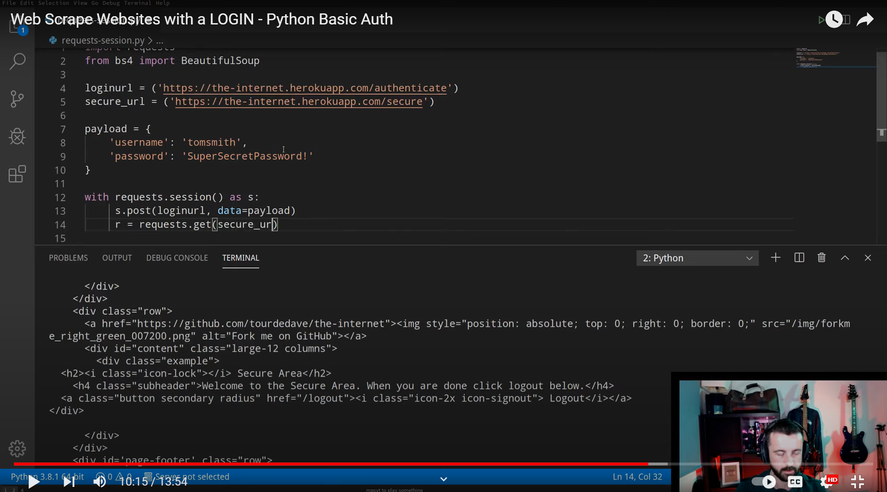 - [youtube video link]('https://youtu.be/cV21EOf5bbA?si=8dy5Y0j-wD-vfD1B') - 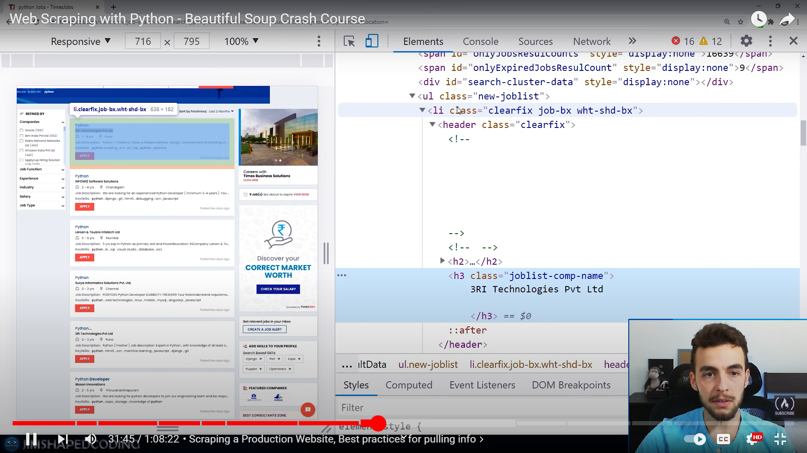 - [youtube video link]('https://youtu.be/XVv6mJpFOb0?si=QY3se2zqKmADyTMR')
After watching these videos I was able to understand the basics of web scraping and I was able to use the python library BeautifulSoup to scrape the website. Now came the practical part of the challenge. I had to login to the website first and then scrape the data.
I divided this task into 3 parts: 1. Login to the website 2. Get the list of courses fron the site 3. Get the list of all assignments and their due dates from the site 4. Mailing the alert to the user when approaching the due time(6hrs before). 1. LOGIN to the site:
I used the requests library to login to the site. I used the post method to send the login credentials to the site and then I used the get method to get the response from the site but i was forgetting an important element for the page to let me log in to the website: the f'ing login tocken.So after a good amount of hours on youtube google and ais I came to know about this and then modified and added this to my code. Here is the code snippet for the same:
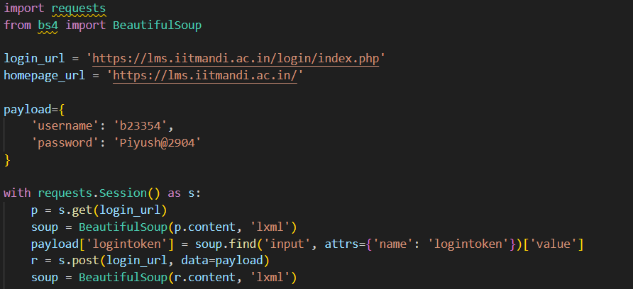
I got the following response from the code above:
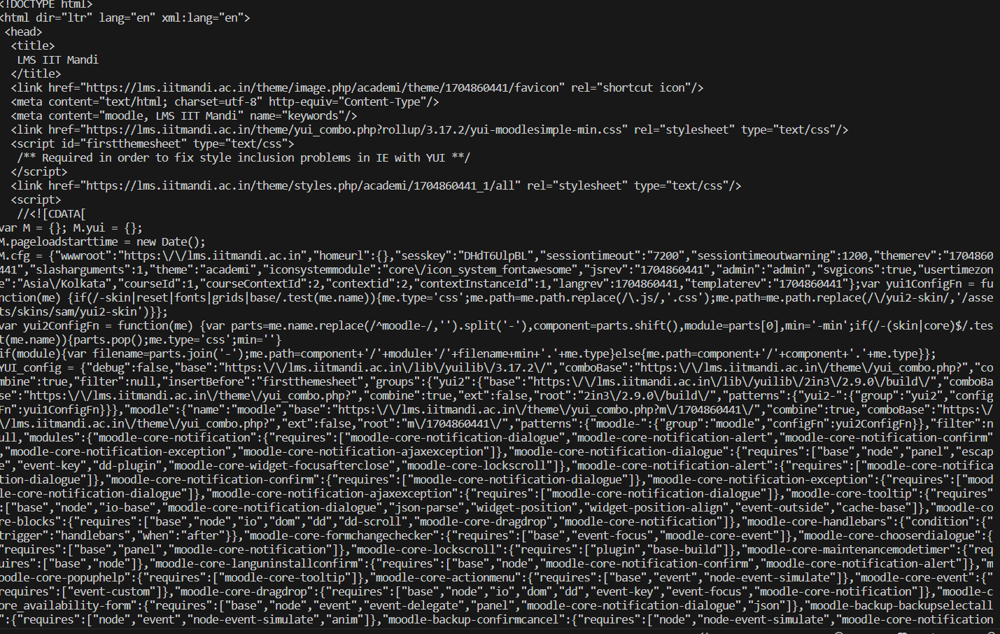
I was able to login to the site successfully.
I was happy. 2. Get the list of courses fron the site:
I got on the site on chrome and inspected the page. I found that that the courses where listed deep inside the html code. I found that the course links for each individual course were listed in the html code as shown below:
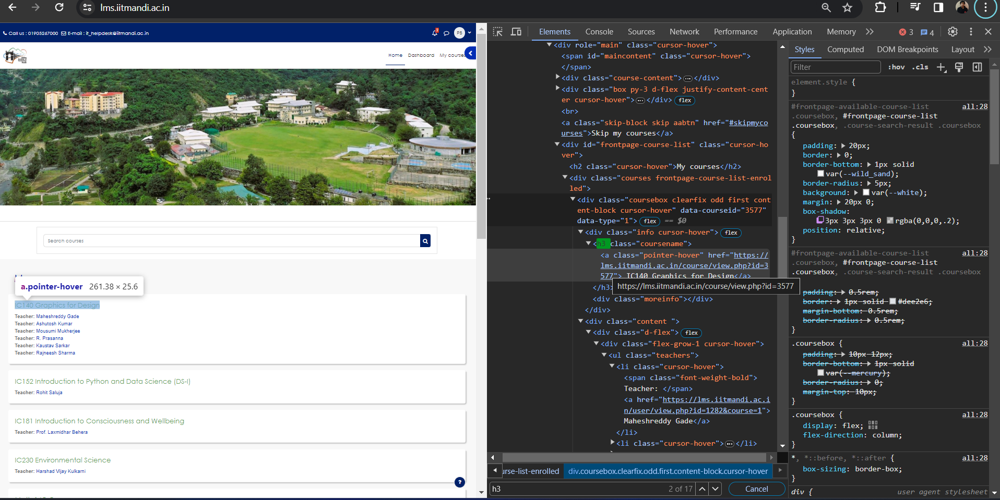
All the course links had a common pattern to them and I exploited this. The pattern is as follows:
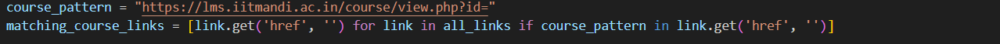
I used the find method as hown in the image above and made a list of all the courses I was enrolled in. I then used the for loop to iterate through the list and print the course names. Here is the code snippet for the same:
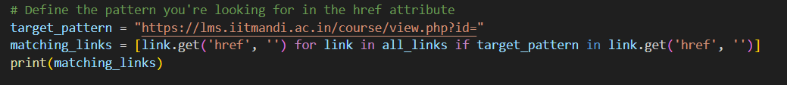
I got the following response from the code above:
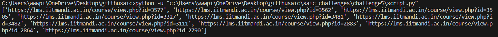  
 I was able to get the list of all the courses I was enrolled in.I was happy. 3. Get the list of all assignments and their due dates from the site:
This was a little bit trickier than I had thought because the assignments were buried deep inside the HTML code and I had to find a way to generalize all of them links. After spending some time on the site I found that the links to the assignments were listed in the html code as shown below:
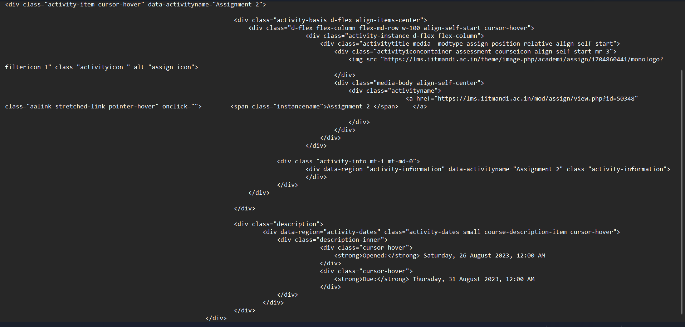
I noticed that all the assignments and info related to them which we needed to provide the user was within the html as :

I just exploited this and wrote a code to create an object of all the assignments containing the course code,assignment name,assignment link and the due date and time.After which I stored all the objects created in a list. Here is the code snippet for the same:
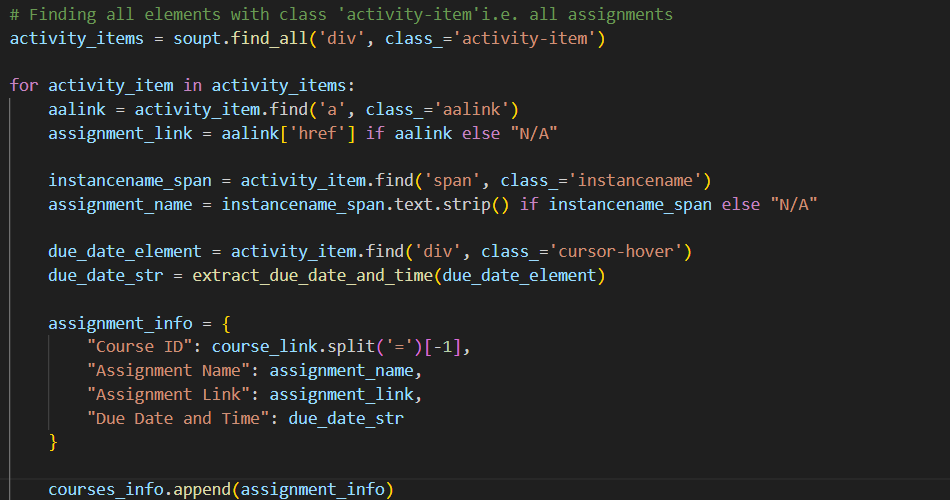
I got the following response from the code above:

Note: I have only shown the first 4 assignments in the list as the list was too long to show here.
I was able to get the list of all the assignments and their due dates.I was too happy. 4. Mailing the alert to the user when approaching the due time(6hrs before):
This was fairly easy because I had already busted my head on mailing service in q2 and therefore was very familiar with the process. I used the smtplib library to send the mail to the user using gmail's smtp. I used the following code to send the mail:
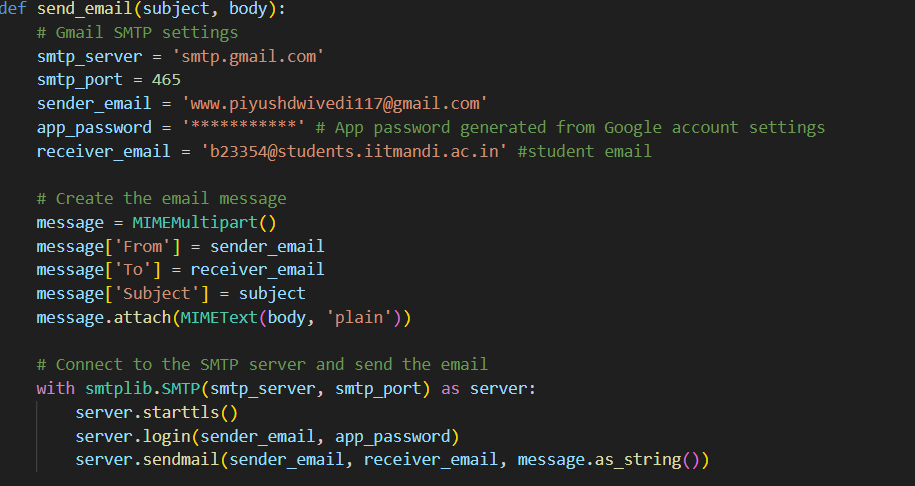
The subject and body of the mail was as follows:
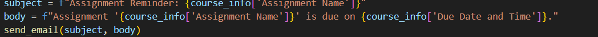
I also added the sleep function in the code for it to periodically check for assignments and send the mail to the user. Here is the code snippet for the same:
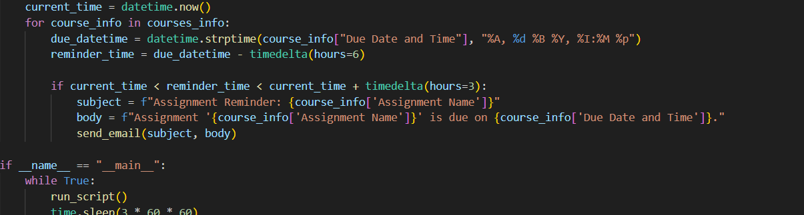
This was fairly easy and sincee I had no open assignments I could not test the mailing part of the code but I am sure it will work because I have already tested all the other parts of the code anf they work perfectly.The mailing part of the code was already tested in question 2 and it worked perfectly.You can read the readme.md of question 2 to see the results.It is also refrenced here:
[Title](../challenge2/readme.md)

All parts of the question were completed successfully and I am very happy with the results.

Also: Anime is good for health.
------------------------DONE---------------------
