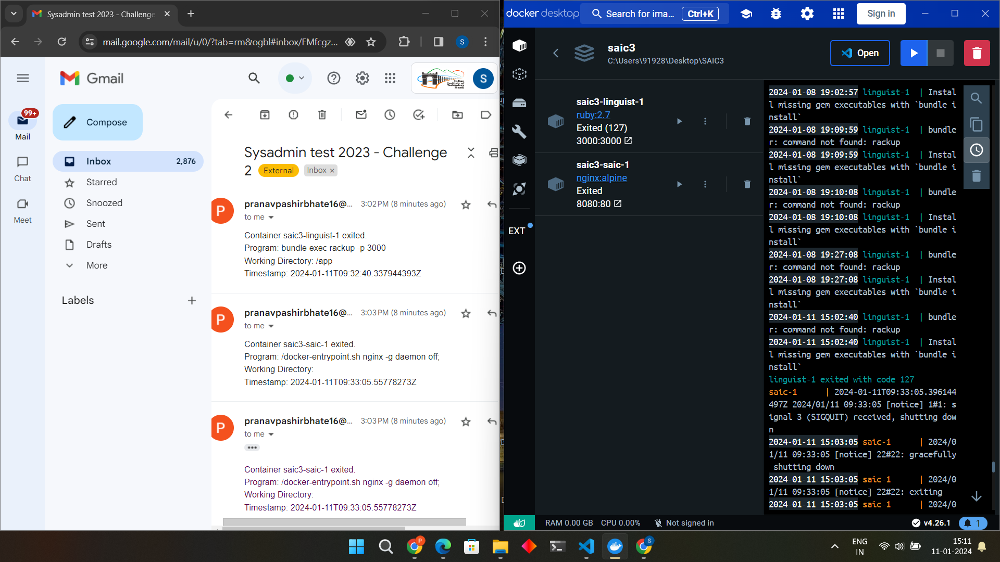

# CHALLENGE-2 : Docker Monitoring & Scripting

## Working
The script is working as per the requirements. My script gives the following output :

1] Container name/id which is started or executed./n
2] The program executed which led to start/stop/kill of our container./n
3] The  working directory in which our container /program was executed./n
4] The exact time in USD when the container started/exited. 

Given below is the Screenshot of how it notifies us when I start and exit the two container from my Docker Desktop...


 This type of mail notifications I got when any container is exited or started as you can see in the image above along with the program which caused the error.:( 

### NOTE- I have used the docker compose files that were required in Challenge-3 for demonstrating this challenge.

## Description of how the script works
The first part of the code is the function to send email notifications to target using the yagmail library.

```python
import yagmail
def send_email(subject, body, to_email):
    # Set up your Gmail credentials
    gmail_user = user_email #Sender's email through which you will send
    gmail_password = user_password  # 16 characters generated password

    # Set up the connection to Gmail
    yag = yagmail.SMTP(gmail_user, gmail_password)

    # Compose the email
    email_subject = subject
    email_body = body

    # Send the email
    yag.send(to=to_email, subject=email_subject, contents=email_body)

```

This is a second function-
```python
import docker

def get_command_info(container):
    config = container.attrs.get("Config")
    cmd = config.get("Cmd")
    entrypoint = config.get("Entrypoint")
    return {
        "Command": " ".join(entrypoint + cmd) if entrypoint else " ".join(cmd),
        "WorkingDir": config.get("WorkingDir", ""),
    }

```

get_command_info(container): This function takes a container object as an argument and returns a dictionary with two keys: Command and WorkingDir. The function extracts the config attribute from the container object, which is a dictionary that contains information about the container configuration. The function then gets the cmd and entrypoint values from the config dictionary, which are lists that specify the command and the entry point for the container. The function joins the entrypoint and cmd lists into a single string and assigns it to the Command key.The function returns the dictionary with the Command and WorkingDir keys.

This is third function which is responsible how we monitor the events-
```python
import traceback
import logging

def monitor_docker_events():
    client = docker.from_env()

    # Iterate over existing containers
    for container in client.containers.list():
        try:
            container_id = container.id
            container_info = client.containers.get(container_id)
            program_info = get_command_info(container_info)
            timestamp = container_info.attrs["State"]["StartedAt"]
            
            subject = "Sysadmin test 2023 - Challenge 2"
            body = f"""Container {container_info.name} started.
                        Program: {program_info['Command']}
                        Working Directory: {program_info['WorkingDir']}
                        Timestamp: {timestamp}"""

            send_email(subject, body, target_email)
            print(subject, body)

        except docker.errors.NotFound:
            logging.warning(f"Container {container_id} not found.")
        except Exception as e:
            logging.error(f"Error processing Docker event: {e}")
            traceback.print_exc()

    # Monitor events for new containers
    for event in client.events(decode=True):
        try:
            container_id = event.get("Actor").get("ID")
            status = event.get("status")

            if status in ["die", "stop"]:
                container_info = client.containers.get(container_id)
                program_info = get_command_info(container_info)
                timestamp = container_info.attrs["State"]["FinishedAt"]
                
                subject = "Sysadmin test 2023 - Challenge 2"
                body = f"""Container {container_info.name} exited.
                        Program: {program_info['Command']}
                        Working Directory: {program_info['WorkingDir']}
                        Timestamp: {timestamp}"""

                send_email(subject, body, target_email)
                print(subject, body)

        except docker.errors.NotFound:
            logging.warning(f"Container {container_id} not found.")
        except Exception as e:
            logging.error(f"Error processing Docker event: {e}")
            traceback.print_exc()


```
monitor_docker_events(): This function creates a client object that connects to the Docker engine using the docker.from_env() method. The function then performs two tasks: iterate over existing containers and monitor events for new containers.

A] Iterate over existing containers: The function uses the client.containers.list() method to get a list of all the containers on the Docker engine. The function then loops over each container in the list and performs the following steps:

1] Try to get the container_id and the container_info object for the current container using the container.id and client.containers.get() methods.
2] Call the get_command_info() function with the container_info object as an argument and store the returned dictionary in the program_info variable.
3] Get the timestamp value from the container_info.attrs[“State”][“StartedAt”] attribute, which is a string that indicates when the container was started.
4] Define the subject and body variables for the email message, using the container_info.name, program_info[‘Command’], program_info[‘WorkingDir’], and timestamp values.
5] Call the send_email() function with the subject, body, and target_email variables as arguments, which sends an email to the target email address with the specified subject and body.
6] Print the subject and body variables to the standard output.
If any exception occurs during the above steps, catch the exception and log the appropriate message using the logging module.

B] Monitor events for new containers: The function uses the client.events(decode=True) method to get an iterator that yields events from the Docker engine. The function then loops over each event in the iterator and performs the following steps:

1] Try to get the container_id and the status values from the event dictionary, using the event.get(“Actor”).get(“ID”) and event.get(“status”) methods.
2] If the status is either “die” or “stop”, which means the container has exited, perform the following steps:
  i] Get the container_info object for the current container using the 
     client.containers.get() method.
  ii] Rest of the steps are same as above as in part A.

Last part of the script-
```python
if __name__ == "__main__":
    logging.basicConfig(filename='docker_monitor.log', level=logging.ERROR)
    monitor_docker_events()
```
The main logic of the code is executed only if the name variable is equal to “main”, which means the code is run as a script and not imported as a module. The code sets the logging configuration using the logging.basicConfig() method, which specifies the filename and the level for the log file. The code then calls the monitor_docker_events() function, which starts the monitoring process.


## Scheduling method

There is no schedulling as the script will be running and monitoring the docker/docker-engine in real-time which would instantaneously notify us.

## Resources:
https://github.com/dashio-connect/docker-dashboard/tree/main/docker-dashboard
