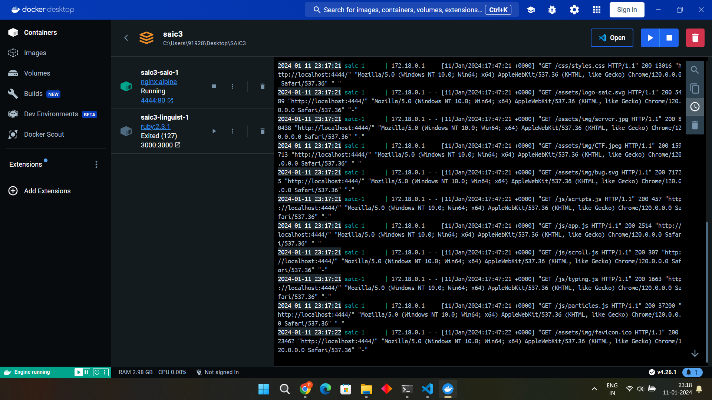
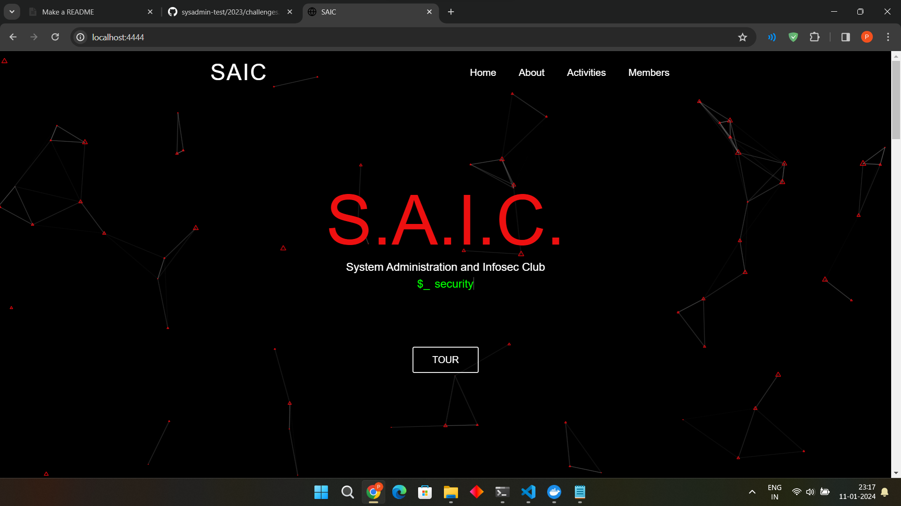

# CHALLENGE:3 Docker Deployments
First we are given two repositories and we need to deploy them on our local host so, our first step will be to take those repositories in our machine. We can do it by using:
```bash
$git clone https://github.com/KamandPrompt/SAIC-Website
$git clone https://github.com/alex-benoit/github-languages.git

``` 
After observing both the repositories we can see that the 1st website is made of html,css and javascript so most preferable image for it would be of 'NGINX' and I have used nginx:alpine as it is lightweight image and it can handle a large number of concurrent connections efficiently, making it suitable for serving static content like HTML, CSS, and JavaScript.This is main reason we chose nginx for our SAIC-website. Now for github-languages we will be using ruby:2.3.1 as one of the file has the following information about it.

So finally, I have written a docker-compose.yml file as-
```python
version: '3'
services:
  saic:
    image: nginx:alpine
    ports:
      - "4444:80"
    volumes:
      - ./SAIC-Website:/usr/share/nginx/html/data
    networks:
      - webnet
  linguist:
    image: ruby:2.3.1
    ports:
      - "3000:3000"
    volumes:
      - ./github-languages:/app 
    working_dir: /app
    command: bundle exec rackup -p 3000
    networks:
      - webnet
networks:
  webnet:
    driver: bridge


```

Let's see how it worked: 


So here as I have mentioned I was able to deploy the SAIC-website but github-languages website was not deployed from me as it showed too many errors regarding the ruby version and while installing the bundler..

Here's how SAIC-website is deployed-

## Script for backing-up volume mapped data as a zip file.
Task:Backup a volume mapped data as a zip file to a folder of your choice everyday at 11:55 pm.
In this task we need to backup the data as a zip file so as I was working in Windows I used the following command-

### RUN the given below command in powershell for scheduling the backup at 11:55 PM everyday.


```

> schtasks /create /tn "BackupTask" /tr "powershell -Command Compress-Archive -Path 'C:\Users\91928\Desktop\SAIC3\SAIC-Website' -DestinationPath 'C:\Users\91928\Desktop\SAIC3\backup_trial\backup_$(Get-Date -Format 'yyyyMMdd_HHmmss').zip'" /sc daily /st 23:55 /f
```
I got the backup file as well just as I have provide.


1] Here in -Path put the path of file where you have cloned SAIC_Website instead of 'C:\Users\91928\Desktop\SAIC3\SAIC-Website' in my case.
2] Here in -DestinationPath put the path of file where you have cloned Github_languages instead of 'C:\Users\91928\Desktop\SAIC3\backup_trial' in my case.


## Reason for choosing this type of network:

For the two containers in my Docker Compose setup (SAIC-website and Github Languages), I have used the following network types:

#### SAIC-website:

Network Type: Bridge
Justification:
A bridge network is suitable for this container as it provides private internal communication between containers on the same network.
The SAIC IIT Mandi website is likely a standalone application without the need for direct communication with other containers. Using a bridge network ensures isolation and security for this container.

#### Github Languages (linguist service):

Network Type: Bridge
Justification:
Since it's a Ruby on Rails application, it might have multiple components (web server, database), and a bridge network allows these components to communicate internally without exposing unnecessary ports to the host machine.
In summary, using bridge networks for both containers provides a good balance between isolation and internal communication. It ensures that each container can communicate with others on the same network while keeping their communication separate from the host machine and other external networks.
 


