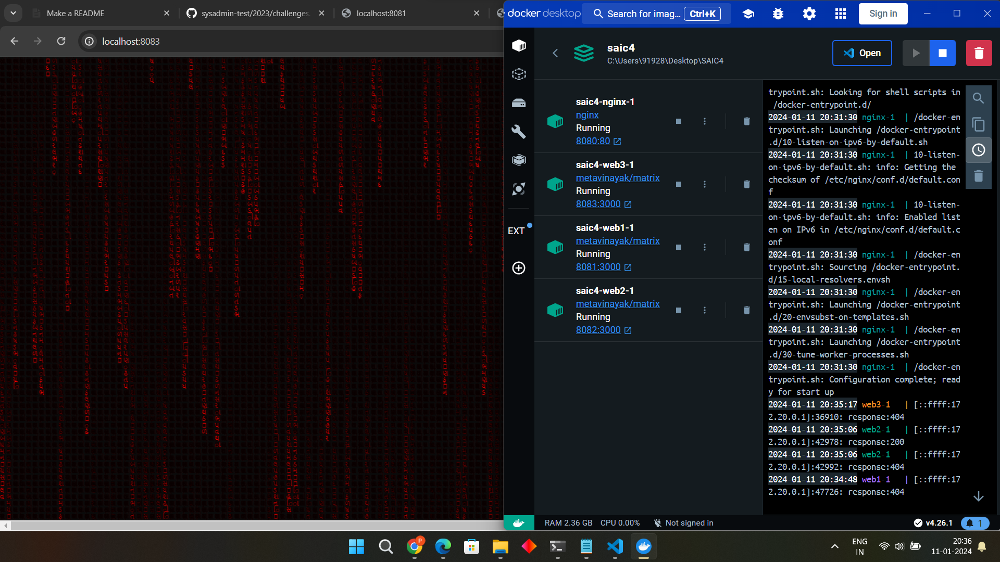
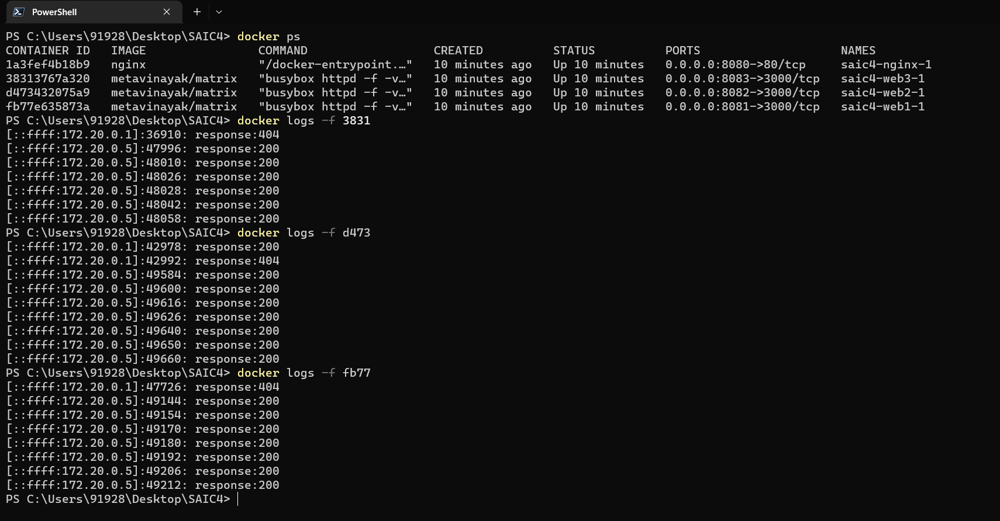

# CHALLENGE:4 Docker and Networks

## TASK:1
Import the subprocess module:
We'll use the subprocess module to run shell commands from the Python script.

#### Define Docker image IDs and credentials:
```python
# Define Docker image IDs
import subprocess
image_ids = ["your_image_id_1", "your_image_id_2"]
# Docker Hub username and password
docker_username = "your_docker_username"
docker_password = "your_docker_password"
```
#### Log in to Docker Hub:
Use the docker login command to log in to Docker Hub. The 'subprocess.run' function is used to execute the shell command.

```python
login_command = f"docker login -u {docker_username} -p {docker_password}"
subprocess.run(login_command, shell=True)
```
#### Pull Docker images:

Iterate over the list of image IDs and use the docker pull command to fetch each Docker image.

```python
for image_id in image_ids:
    # Pull the Docker image
    pull_command = f"docker pull {image_id}"
    subprocess.run(pull_command, shell=True)
```	


#### Run or deploy our application with the new images:

```python
# Example: run_command = f"docker run -d -p 8080:80 {image_id}"
```
Uncomment and modify the run_command line according to our application deployment needs.

#### Log out from Docker Hub:
After pulling the images and deploying the application, use the docker logout command to log out from Docker Hub.

```python
logout_command = "docker logout"
subprocess.run(logout_command, shell=True)
```
#### Save the script and run it:
Save the script with a .py extension ( deploy_images.py) and make it executable. Run the script using the Python interpreter.

```bash
python deploy_images.py
```
## TASK:2
In this task we have to balance the load among the three instances created. So after surfing on internet I  found various algorithms of load balance such as round-cycle,weighted round-cycle,...and so on but each of these have some pros and cons depending on the capability of our servers and the amount of request that are being passed at an instance so, after whole surfing I concluded that 'NGINX' does all the load balancing according to the situation on its own so I decided to use 'NGINX' as a load balancer.

Firstly I started 3 instances web1,web2,web3 as I generalised them and started my NGINX which would depend on these 3 web1,web2,web3 as I did in the 'docker-compose.yml' file and designed a 'nginx.conf' file as provided.

I gave the ports as --> 
NGINX:8080
web1:8081
web2:8082
web3:8083

Then I made a script 'check.ps1' which would send specified no. of requests to our server at a same time to test our load balancing, so let's test our load balancing by sending 20 requests at a time.

First let's see whether our 3 instances are deployed or not-
```bash
PS C:\Users\91928\Desktop\SAIC4> docker-compose up -d
[+] Running 4/4
 ✔ Container saic4-web1-1   Started                                                                                0.1s
 ✔ Container saic4-web3-1   Started                                                                                0.1s
 ✔ Container saic4-web2-1   Started                                                                                0.1s
 ✔ Container saic4-nginx-1  Started                                                                                0.1s
PS C:\Users\91928\Desktop\SAIC4>
```
So yeah they are deployed...Here's screenshot how it looked on local host and docker-desktop:


Now let's run our script of sending 20 requests and see how load is balanced:


Hurray..!! It works..:)

## TASK:3

#### Custom Log File Architecture:


```bash
/logs

|-- web1
|   |
|   |-- access.log
|   |-- error.log

|-- web2
|   |
|   |-- access.log
|   |-- error.log

|-- web3
|   |
|   |-- access.log
|   |-- error.log
```
--> In this architecture:


1] Each Docker instance (web1, web2, etc.) has its own directory.

2] Inside each instance directory, there are separate access and error log files.

####NOTE-> I tried making the architecture like this but it didn't worked as the web1,web2 and web3 folders remained empty. In my files the directory logs/web1, logs/web2, logs/web3 is formed but insite it no files formed.I was unable to sort it out what's wrong.Even I don't know whether it is correct or not.:)


-----------------------------------------------------------------------------------------------------------------------


#### --> Justification for Custom Log File Architecture:


1] Isolation and Organization:

	Custom log directories for each Docker instance provide clear isolation and organization.
 	This makes it easier to locate and analyze logs for specific instances, especially in a multi-container environment.

2] Scalability:

	As our application scales, having logs organized by instance facilitates scalability.
	It becomes more manageable to analyze logs when dealing with a larger number of instances.

3] Easy Maintenance:

	The custom log architecture simplifies log maintenance. For example, if you need to clear logs
	for a specific instance, you can do so without affecting other instances.

4] Efficient Troubleshooting:

	When troubleshooting, having logs organized by instance allows you to focus on a specific container,
	reducing the scope of investigation and speeding up the debugging process.

-------------------------------------------------------------------------------------------------------------------------
## RESOURCES 

1] https://dev.to/ken_mwaura1/automate-docker-image-builds-and-push-to-docker-hub-using-github-actions-32g5