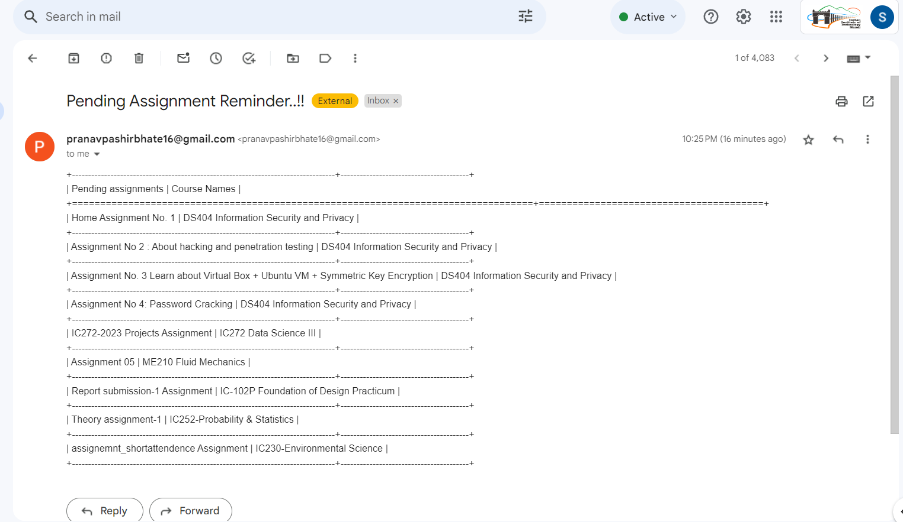

# CHALLENGE-5 : Scripting

## A] Approach
The approach that I found out useful was  simple 'WEBSCRAPPING' as I did not found/thought of any better approach :)

So First I did the scrapping of login page of our LMS site as authentication is required so I wrote a simple code to extract the source code of webpage which is openly available and using BeautifulSoup Library I extracted the part where we give our input username and password and created a session with same cookies --> Next page was where all the course names are available so with similar scrapping I scrapped all  the course names and all the links that they redirect us-->Next page is where we see all of the course contents so with similar approach I observed that the links related to Assignments have one thing in common which is '/assign',so I scrapped all those URLs--> Next page was the status of assignments. So I grabbed only those status of submissions where there was written 'No submissions have been made yet' and there corresponding time remaining.

The final step involved sending an email so i made a tabular format of pending assignments and there corresponding courses. Email was sent in a similar fashion as in CHALLENGE-2.

This is a script that I ran in Powershell which schedules the tasks for us. Here I can set the day and the time at which we want to run our script. As given in the challenge, we need to be notified before 6hrs so this script we can schedule this script accordingly for example-->Most assignment deadlines are on SUNDAY so we can schedule our script to run at 6PM on SUNDAY.

```bash
PS C:\Users\91928> schtasks /create /sc once /tn "MyScriptTask" /tr "C:\Users\91928\Desktop\SAIC5\SAIC5.py" /st "17:17"
SUCCESS: The scheduled task "MyScriptTask" has successfully been created.
PS C:\Users\91928>
```
We can use crontab as well in linux but as I was working in Windows I used 'schtasks'.


## B] DEMO/Tutorial(Recommended)

1> First give your credentials in the 'cred5.py' file. Main script is in SAIC5.py.

2> Just run the above command as per your need by properly changing the paths and required time in Powershell or use crontab instead. 

3> Given below is Screenshot of how it really worked on my system? :)

